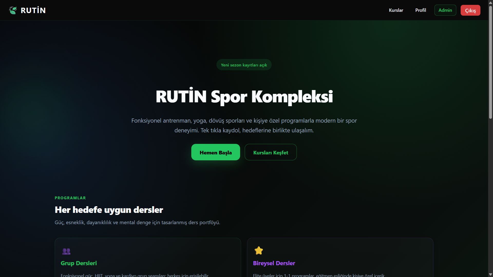
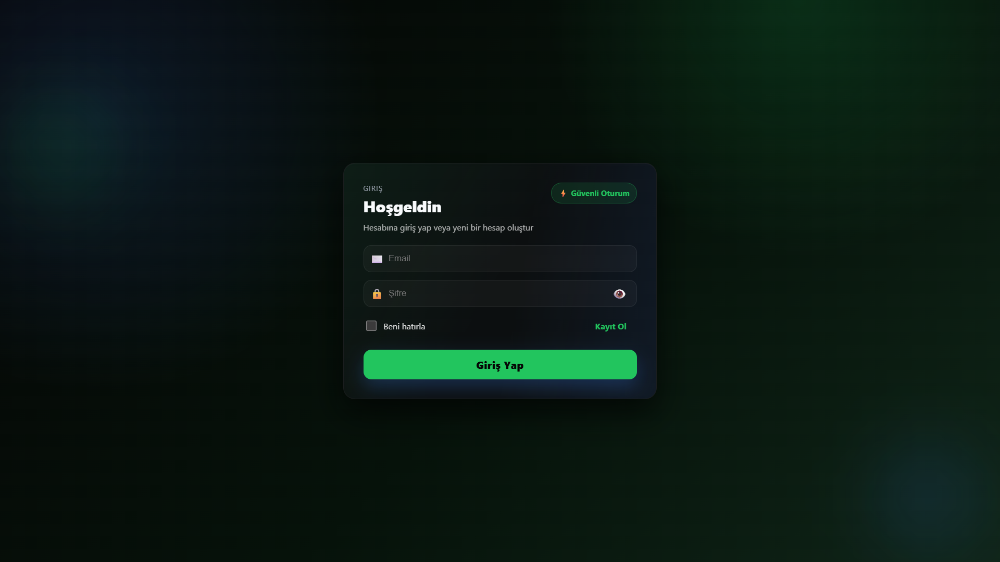
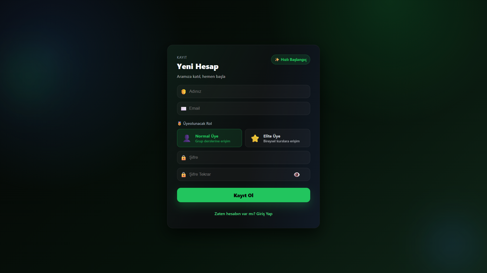
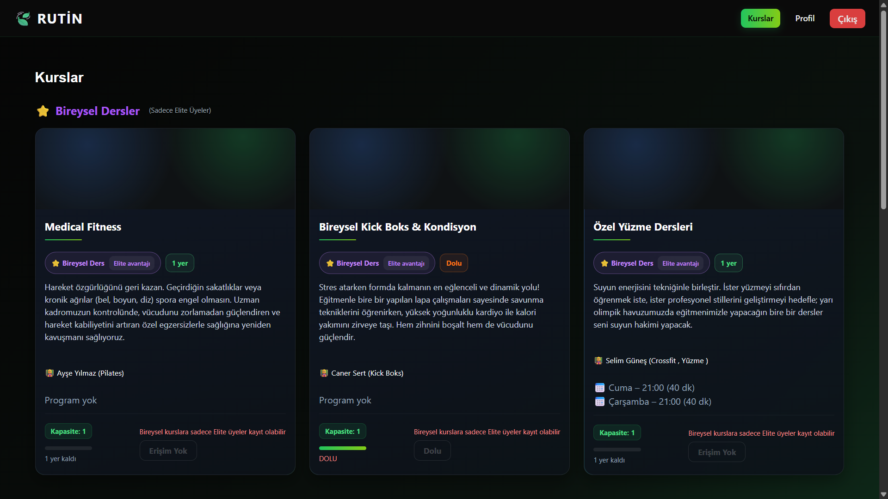
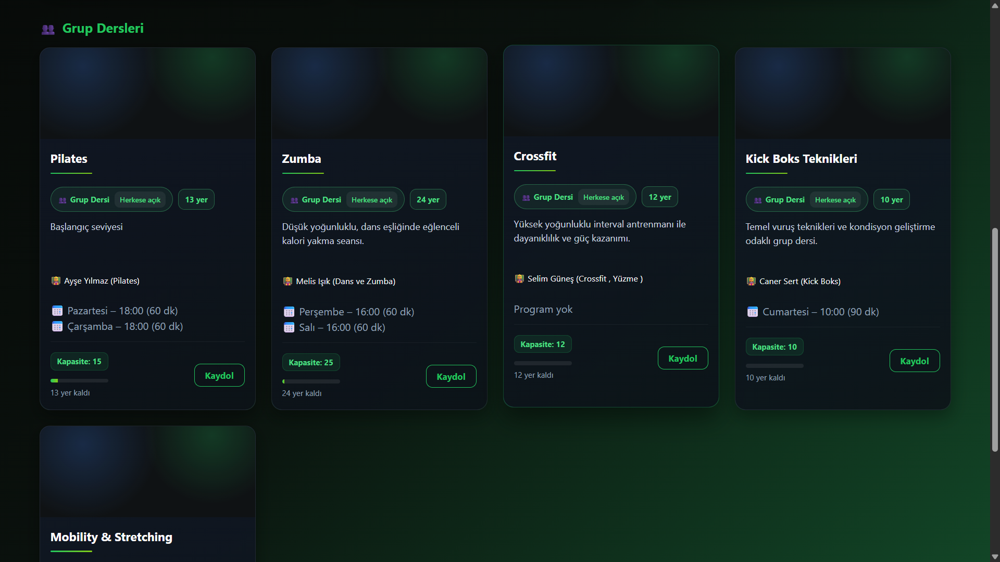
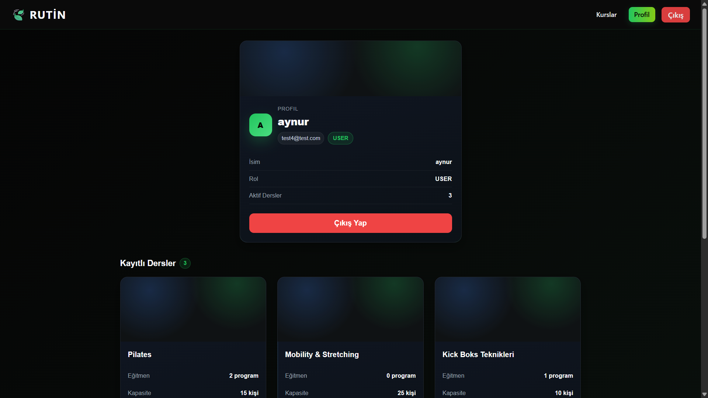
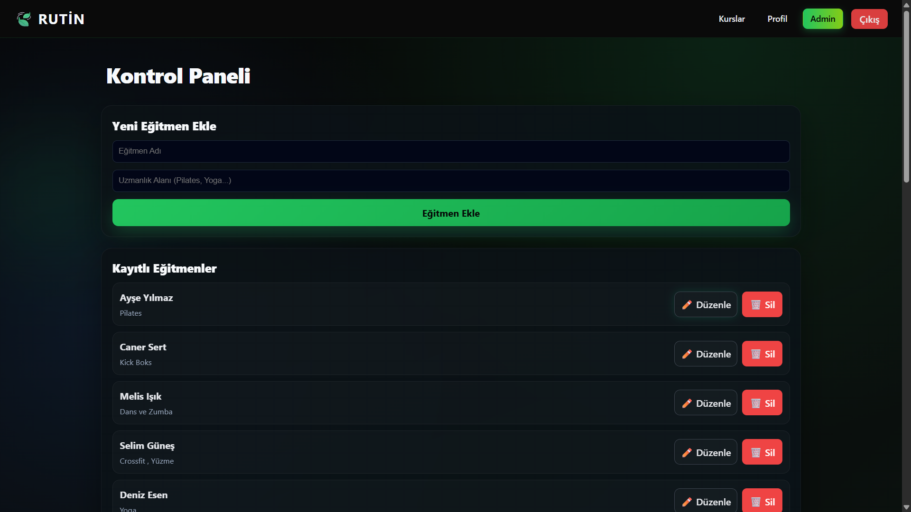
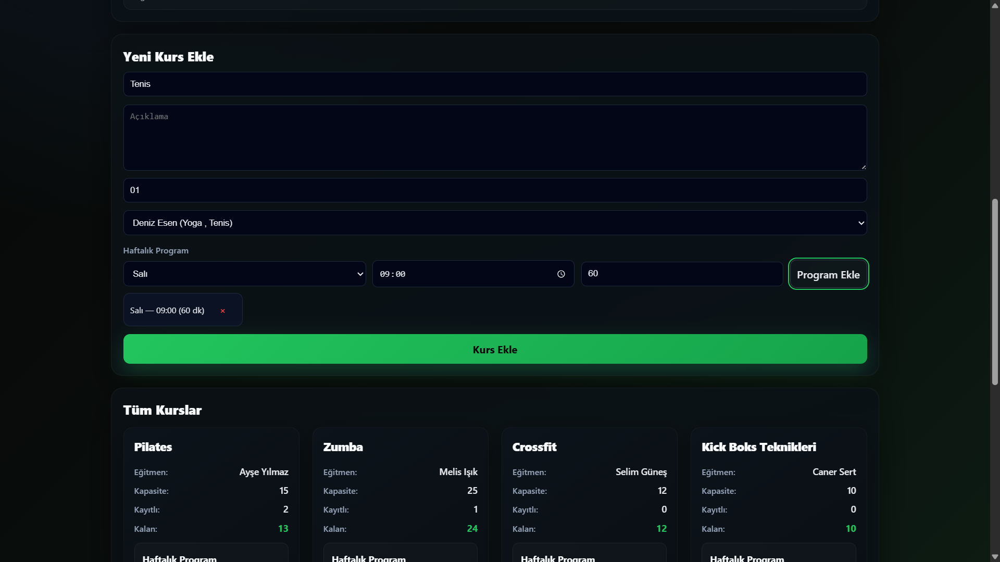

# SPOR KOMPLEKSİ YÖNETİM SİSTEMİ

---

## 1. PROJE HAKKINDA

### 1.1 Proje Tanımı

Proje, spor kompleksleri için geliştirilmiş modern bir web tabanlı yönetim sistemidir. Sistem, kurs yönetimi, eğitmen takibi, üye kaydı ve program planlama gibi temel işlevleri dijital ortamda gerçekleştirmeyi sağlar.

### 1.2 Kullanılan Teknolojiler

**Backend:**

- NestJS (Node.js Framework)
- TypeScript
- TypeORM (ORM Katmanı)
- JWT (Kimlik Doğrulama)
- PostgreSQL/MySQL (Veritabanı)

**Frontend:**

- React 18
- TypeScript
- Vite (Build Tool)
- React Router (Sayfa Yönlendirme)
- Axios (HTTP İstekleri)

### 1.3 Proje Paylaşım Linki

**GitHub Repository:** `[https://github.com/AynurAltintas/gym-app.git]`

---

## 2. SİSTEM MİMARİSİ

### 2.1 Genel Mimari

Proje, modern bir **monorepo** yapısında geliştirilmiştir:

- **gym-backend:** NestJS ile geliştirilmiş RESTful API
- **gym-frontend:** React ile geliştirilmiş kullanıcı arayüzü

İki katman birbirinden bağımsız çalışır ve HTTP protokolü üzerinden JSON formatında iletişim kurar.

### 2.2 Kimlik Doğrulama ve Yetkilendirme

Sistem üç temel kullanıcı rolü destekler:

- **Admin:** Tam yetki (kurs, eğitmen, program yönetimi)
- **EliteUser:** Kurslara kayıt olma, öncelikli kontenjan ve ek yetkiler (admin dışı en yetkili kullanıcı)
- **User:** Standart üye, kurslara kayıt olma ve profil yönetimi

JWT (JSON Web Token) tabanlı kimlik doğrulama kullanılmaktadır. Token'lar localStorage'da saklanır ve her API isteğinde `Authorization: Bearer <token>` header'ı ile gönderilir.

---

## 3. BACKEND ENDPOINTLERİ

### 3.1 Kimlik Doğrulama (Auth)

#### `POST /auth/register`

**Açıklama:** Yeni kullanıcı kaydı oluşturur.Yeni bir üye sisteme kayıt olduğunda bu endpoint çağrılır.
**Gerekli Veriler:**

- email (string)
- password (string)
- role (string: 'user', 'eliteuser', 'admin')

**Yanıt:** Kullanıcı bilgileri ve JWT token

---

#### `POST /auth/login`

**Açıklama:** Mevcut kullanıcının sisteme giriş yapmasını sağlar.Kullanıcı giriş formunu doldurduğunda email ve şifre bu endpoint'e gönderilir, başarılı olursa token döner.
**Gerekli Veriler:**

- email (string)
- password (string)

**Yanıt:** JWT access token

---

### 3.2 Kullanıcı Yönetimi (Users)

#### `GET /users/profile`

**Açıklama:** Giriş yapmış kullanıcının profil bilgilerini getirir.Kullanıcı profil sayfasını açtığında veya navbar'da kullanıcı bilgisi gösterilirken çağrılır.  
**Yetkilendirme:** JWT Token gerekli  
**Yanıt:** Kullanıcı ID, email, rol bilgileri

---

### 3.3 Eğitmen Yönetimi (Trainers)

#### `GET /trainers`

**Açıklama:** Sistemdeki tüm eğitmenleri listeler. Kurs oluşturulurken eğitmen seçimi için veya ana sayfada eğitmen listesi gösterilirken kullanılır.
**Yetkilendirme:** Herkese açık  
**Yanıt:** Eğitmen ID, ad, uzmanlık alanı

---

#### `POST /trainers`

**Açıklama:** Yeni eğitmen kaydı oluşturur.Admin panelinde yeni eğitmen eklendiğinde çağrılır.  
**Gerekli Veriler:**

- name (string)
- expertise (string)

**Yetkilendirme:** Herkes (ancak frontend admin panelinde kontrol edilir)  
**Yanıt:** Oluşturulan eğitmen bilgileri

---

#### `PATCH /trainers/:id`

**Açıklama:** Mevcut bir eğitmenin bilgilerini günceller.Admin panelinde eğitmen düzenleme formundan "Kaydet" butonuna basıldığında çağrılır.

**Gerekli Veriler:**

- name (string, opsiyonel)
- expertise (string, opsiyonel)

**Yetkilendirme:** Sadece Admin (JWT + Role Guard)  
**Yanıt:** Güncellenmiş eğitmen bilgileri

---

#### `DELETE /trainers/:id`

**Açıklama:** Belirtilen eğitmeni sistemden siler.Admin panelinde eğitmen satırındaki "Sil" butonuna basıldığında çağrılır.
**Yetkilendirme:** Sadece Admin (JWT + Role Guard)  
**Yanıt:** Silme onay mesajı

---

### 3.4 Kurs Yönetimi (Courses)

#### `GET /courses`

**Açıklama:** Sistemdeki tüm kursları, eğitmen bilgileri ve kayıtlı öğrencilerle birlikte getirir.Ana sayfa veya kurslar sayfası açıldığında tüm kursları göstermek için çağrılır.
**Yetkilendirme:** Herkese açık  
**Yanıt:** Kurs listesi (ID, başlık, açıklama, kapasite, kalan kontenjan, eğitmen, kayıtlı öğrenciler, program)

---

#### `POST /courses`

**Açıklama:** Yeni kurs oluşturur. Admin panelinde "Yeni Kurs Ekle" formu doldurulup gönderildiğinde çağrılır.
**Gerekli Veriler:**

- title (string)
- description (string)
- capacity (number)
- trainerId (number)

**Yetkilendirme:** Herkese açık (frontend admin kontrolü)  
**Yanıt:** Oluşturulan kurs bilgileri

---

#### `DELETE /courses/:id`

**Açıklama:** Belirtilen kursu siler.Admin panelinde kurs kartındaki "Sil" butonuna basıldığında çağrılır.
**Yetkilendirme:** Sadece Admin (JWT + Role Guard)  
**Yanıt:** Silme onay mesajı

---

### 3.5 Kayıt Yönetimi (Enrollments)

#### `POST /enrollments`

**Açıklama:** Giriş yapmış kullanıcıyı belirtilen kursa kaydeder.  
**Gerekli Veriler:**

- courseId (number)

**Yetkilendirme:** JWT Token gerekli  
**Yanıt:** Kayıt bilgileri

**Kullanım Senaryosu:** Kullanıcı bir kursa "Kayıt Ol" butonuna bastığında çağrılır. Sistem otomatik olarak token'dan kullanıcıyı belirler.

---

#### `DELETE /enrollments/:courseId`

**Açıklama:** Giriş yapmış kullanıcının belirtilen kurstaki kaydını iptal eder. Kullanıcı kayıtlı olduğu bir kurstan "Kaydı İptal Et" butonuna bastığında çağrılır.
**Yetkilendirme:** JWT Token gerekli  
**Yanıt:** İptal onay mesajı

---

### 3.6 Program Yönetimi (Schedules)

#### `POST /schedules`

**Açıklama:** Bir kursa haftalık program (gün, saat, süre) ekler.Admin panelinde kurs oluştururken haftalık programa birden fazla zaman dilimi eklendiğinde her biri için çağrılır.
**Gerekli Veriler:**

- courseId (number)
- day (string: Pazartesi, Salı, vb.)
- startTime (string: HH:MM formatı)
- duration (number: dakika cinsinden)

**Yetkilendirme:** Herkese açık (frontend admin kontrolü)  
**Yanıt:** Oluşturulan program bilgileri

---

## 4. FRONTEND COMPONENTLERİ

### 4.1 Sayfa Componentleri (Pages)

#### `Home.tsx`

**Görev:** Uygulamanın ana sayfasıdır. Hoş geldiniz mesajı ve sisteme giriş yapmamış kullanıcılar için yönlendirme linklerini içerir.  
**Özellikler:**

- Hero bölümü ile modern tasarım
- Gradient arka plan efektleri
- Giriş ve kayıt butonları

---

#### `Login.tsx`

**Görev:** Kullanıcı giriş formunu içerir.  
**Özellikler:**

- Email ve şifre giriş alanları
- `POST /auth/login` endpoint'ine istek gönderir
- Başarılı girişte token'ı localStorage'a kaydeder
- Ana sayfaya yönlendirir

---

#### `Register.tsx`

**Görev:** Yeni kullanıcı kayıt formunu içerir.  
**Özellikler:**

- Email, şifre ve rol seçimi
- `POST /auth/register` endpoint'ine istek gönderir
- Başarılı kayıtta kullanıcıyı login sayfasına yönlendirir

---

#### `Profile.tsx`

**Görev:** Kullanıcının kayıtlı olduğu kursları gösterir.  
**Özellikler:**

- `GET /users/profile` ile kullanıcı bilgilerini alır
- `GET /courses` ile kursları alır ve kullanıcının kayıtlı olduklarını filtreler
- Her kurs için "Kaydı İptal Et" butonu
- Stil: Kart tabanlı tasarım

---

#### `Courses.tsx`

**Görev:** Tüm kursları listeler ve kullanıcının kayıt olmasını sağlar.  
**Özellikler:**

- `GET /courses` ile tüm kursları getirir
- Her kurs kartında: başlık, eğitmen, kapasite, kalan kontenjan
- Kullanıcı giriş yapmışsa ve kursa kayıtlı değilse "Kayıt Ol" butonu
- Kayıtlıysa "Kayıtlısınız" badge
- Kontenjan doluysa "DOLU" uyarısı

---

#### `AdminRoute.tsx`

**Görev:** Sadece admin kullanıcıların erişebileceği sayfaları korur.  
**Özellikler:**

- Token kontrolü yapar
- Kullanıcı profilini çeker ve role kontrol eder
- Role 'admin' değilse ana sayfaya yönlendirir

---

#### `Navbar.tsx`

**Görev:** Üst navigasyon çubuğu.  
**Özellikler:**

- "RUTİN" logosu ve ana sayfa linki
- Kullanıcı giriş yapmışsa: Kurslar, Profil, Çıkış butonları
- Admin rolündeyse ek olarak "Admin" linki
- Giriş yapmamışsa: Giriş ve Kayıt Ol linkleri
- Responsive tasarım

#### `PrivateRoute.tsx`

**Görev:** Korumalı sayfalara erişimi kontrol eder.  
**Özellikler:**

- localStorage'dan token varlığını kontrol eder
- Token yoksa kullanıcıyı login sayfasına yönlendirir
- Token varsa alt component'i render eder

---

#### `AdminRoute.tsx`

**Görev:** Sadece admin kullanıcıların erişebileceği sayfaları korur.  
**Özellikler:**

- Token kontrolü yapar
- Kullanıcı profilini çeker ve role kontrol eder
- Role 'admin' değilse ana sayfaya yönlendirir

---

#### `TrainerRoute.tsx`

**Görev:** Sadece eğitmen kullanıcıların erişebileceği sayfaları korur.  
**Özellikler:**

- Token ve rol kontrolü
- Eğitmen değilse erişimi engeller

---

### 4.3 API ve Yardımcı Modüller

#### `axios.ts`

**Görev:** Merkezi HTTP istemcisi.  
**Özellikler:**

- Base URL: `http://localhost:3000`
- Request interceptor: Her istekte localStorage'dan token'ı alıp header'a ekler
- Response interceptor: 401 hatası alınırsa token'ı temizler
- CORS desteği (withCredentials)

---

#### `types/index.ts`

**Görev:** TypeScript tip tanımları.  
**İçerik:** User, Course, Trainer, Enrollment gibi veri modellerinin tip tanımları

## 5. VERİTABANI DİYAGRAMI

**Tablo İlişkileri:**

| Tablo               | İlişki          | Açıklama                                        |
| ------------------- | --------------- | ----------------------------------------------- |
| User ↔ Trainer      | 1:1 (opsiyonel) | Bir eğitmenin bir kullanıcı hesabı olabilir     |
| Trainer ↔ Course    | 1:N             | Bir eğitmen birden fazla kurs verebilir         |
| Course ↔ Schedule   | 1:N             | Bir kursun birden fazla program zamanı olabilir |
| User ↔ Enrollment   | 1:N             | Bir kullanıcı birden fazla kursa kayıt olabilir |
| Course ↔ Enrollment | 1:N             | Bir kursa birden fazla kullanıcı kayıt olabilir |

**Çoka Çok İlişki Notu:**

User ve Course arasında **çoka çok (N:N)** ilişki bulunmaktadır. Bu ilişki `Enrollment` ara tablosu (junction table) aracılığıyla yönetilir:

- Bir kullanıcı birden fazla kursa kayıt olabilir
- Bir kursa birden fazla kullanıcı kayıt olabilir
- Her kayıt Enrollment tablosunda kaydedilir (userId + courseId kombinasyonu)

## 6. PROJE GELİŞTİRİM SÜRECİ

### 6.1 Backend Geliştirme Adımları

1. **Proje İskeletinin Oluşturulması**

   - NestJS CLI ile temel proje yapısı oluşturuldu
   - TypeORM ve veritabanı bağlantısı yapılandırıldı

2. **Entity Tanımları**

   - User, Trainer, Course, Enrollment, Schedule entity'leri oluşturuldu
   - İlişkiler (OneToMany, ManyToOne, OneToOne) tanımlandı

3. **Module ve Service Katmanları**

   - Her varlık için ayrı module oluşturuldu
   - CRUD işlemleri için service katmanı geliştirildi

4. **Controller Katmanı ve Endpoint'ler**

   - RESTful API prensiplerine uygun endpoint'ler tanımlandı
   - HTTP metodları (GET, POST, PATCH, DELETE) uygulandı

5. **Kimlik Doğrulama ve Yetkilendirme**

   - JWT stratejisi implemente edildi
   - JwtAuthGuard ve RolesGuard guard'ları oluşturuldu
   - Roles decorator ile rol tabanlı erişim kontrolü sağlandı

6. **Validation ve Error Handling**
   - DTO (Data Transfer Object) sınıfları ile input validasyonu
   - Custom exception handler'lar

### 6.2 Frontend Geliştirme Adımları

1. **Proje Kurulumu**

   - Vite ile React + TypeScript projesi oluşturuldu
   - React Router ve Axios kuruldu

2. **Routing Yapısı**

   - Ana routes tanımlandı
   - Protected route wrapper'ları (PrivateRoute, AdminRoute) oluşturuldu

3. **API Entegrasyonu**

   - Axios instance yapılandırıldı
   - Interceptor'lar ile token yönetimi

4. **Sayfa Componentleri**

   - Auth sayfaları (Login, Register)
   - Kullanıcı sayfaları (Home, Profile, Courses)
   - Admin paneli

5. **State Yönetimi**

   - Local state ile component bazlı state yönetimi
   - localStorage ile token persistence

6. **Styling ve UI/UX**
   - Modern CSS ile gradient arka planlar
   - Responsive tasarım
   - Dark theme

### 6.3 Test ve Deployment

1. **Local Test**

   - Backend: `npm run start:dev` ile development sunucusu
   - Frontend: `npm run dev` ile Vite dev server

2. **API Testleri**
   - Postman/Thunder Client ile endpoint testleri
   - Frontend üzerinden end-to-end test

---

## 7. EKRAN GÖRÜNTÜLERİ

### 7.1 Ana Sayfa

### 7.2 Giriş ve Kayıt Sayfası

### 7.3 Kurslar Sayfası

### 7.4 Profil Sayfası

### 7.5 Admin Paneli

---

**Hazırlayan:** Aynur Altıntaş  
**Tarih:** Ocak 2026
